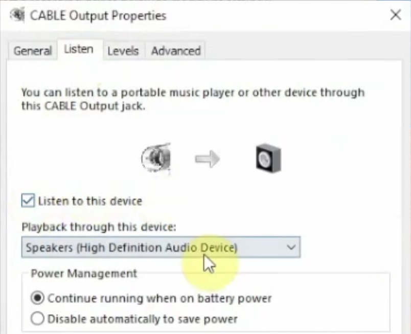
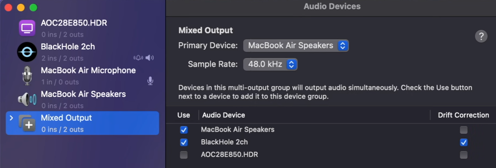

# MeetingTwin

## Purpose
MeetingTwin is an advanced AI-powered meeting assistant designed to run locally on your machine. It acts as a "twin" that listens to your meetings in real-time, transcribing both the audio from your computer (what others say) and your microphone (what you say). 

By leveraging Deepgram for high-speed transcription and Large Language Models (LLM) like Anthropic's Claude or Groq, MeetingTwin maintains a full context of the conversation. This allows you to ask questions about the meeting while it's happening, catch up on missed details, or get clarifications without interrupting the flow of the call.

**Core Features:**
- **Real-time Transcription**: Captures and transcribes both system audio and microphone input simultaneously.
- **Context-Aware AI Assistant**: Maintains a history of the conversation to answer your questions accurately.
- **Dual-Source Recording**: Distinguishes between "User" (you) and "Caller" (meeting participants).
- **Flexible LLM Support**: Supports both Anthropic (Claude) and Groq for AI inference.

## Requirements

To use MeetingTwin, you need the following:

1.  **Node.js**: Ensure Node.js is installed on your system.
2.  **API Keys**:
    -   **Deepgram API Key**: For real-time speech-to-text transcription.
    -   **Anthropic API Key** OR **Groq API Key**: For the AI intelligence layer.
3.  **Loopback Audio Driver (Crucial)**: 
    MeetingTwin needs to "hear" what is playing on your computer speakers (the meeting audio). To do this, you must install a virtual audio loopback driver. This driver routes your system output back as an input device that the application can record.

    *   **macOS Users**: Install **BlackHole** (2ch version is sufficient).
        *   [Download BlackHole](https://github.com/ExistentialAudio/BlackHole?tab=readme-ov-file#installation-instructions)
    *   **Windows Users**: Install **VB-Audio Cable**.
        *   [Download VB-Audio Cable](https://vb-audio.com/Cable/)

    *Why is this required?* Standard operating systems do not allow applications to record "what you hear" by default for privacy and architecture reasons. The loopback driver bridges this gap, creating a virtual microphone that streams your system audio.

## Setup

Follow these steps to get MeetingTwin running:

### 1. Installation

Clone the repository and install the dependencies:

```bash
git clone <repository-url>
cd MeetingTwin
npm install
```

### 2. Configuration

Create your environment configuration file by copying the example:

```bash
cp .env.example .env
```

Open `.env` in your text editor and fill in your API keys:
- `DEEPGRAM_API_KEY`: Your key from Deepgram.
- `GROQ_API_KEY`: Your key from Groq (if using Groq).
- `ANTHROPIC_API_KEY`: Your key from Anthropic (if using Claude).
- `DEEPGRAM_LANGUAGE`: Meeting language (see: https://developers.deepgram.com/docs/models-languages-overview)

(change model if needed)

### 3. Audio Device Configuration

You need to tell MeetingTwin which audio devices to listen to.

1.  Run the audio check utility:
    ```bash
    node check-audio.js
    ```
2.  Look at the output. You will see a list of devices with IDs.
    *   Find your **Microphone** device ID.
    *   Find your **Loopback/System** device ID (e.g., "BlackHole 2ch" or "CABLE Output"). Suggested devices are marked with *** POTENTIAL LOOPBACK DEVICE ***

3.  Update your `.env` file with these IDs:
    ```env
    AUDIO_DEVICE_ID_MIC=<your-microphone-id>
    AUDIO_DEVICE_ID_SYSTEM=<your-loopback-device-id>
    ```
4.   Ensure your meeting software (Zoom, Teams, etc.) is outputting audio to the Loopback device so MeetingTwin can hear it.
    To also listen to the audio youself during the meeting:
    - **Windows**: Listen to the virtual device from your output in windows settings.
    
    - **macOS**: Create a mixed audio output with the virtual microphone (BlackHole 2ch).
    

### 4. Select AI Client

By default, the application is set up to use **Groq** if the api key are provided.
Switch to **Claude** if it's api keys are provided instead.

## Usage

Once configured, start the application:

```bash
node index.js
```

### Interaction Guide

The application interface will appear in your terminal. As the meeting progresses, you will see real-time transcripts appear labeled as `[user]` (you) or `[#number]` (participants).

**Asking Questions:**
You can interact with the AI assistant at any time by typing into the terminal prompt `MeetingTwin >`.

*   **Clarification**: "What did the caller just say about the deadline?"
*   **Summarization**: "Summarize the last 5 minutes of discussion."
*   **Action Items**: "Did anyone mention next steps for the project?"
*   **Translation**: "Translate the last point into Italian."

**Speaker Identification:**
The system automatically labels audio from your microphone as **User** and audio from the loopback device as number to distinguish different callers. 

**Commands:**
*   Type `exit` or `quit` to close the application.

**Outputs:**
At the end of the meeting the agent will produce two files in the meeting directory:
*   `<data>-meeting-transcript.txt`: A text file containing the full transcript of the meeting.
*   `<data>-meeting-recap.md`: A markdown file with a summary of the meeting.